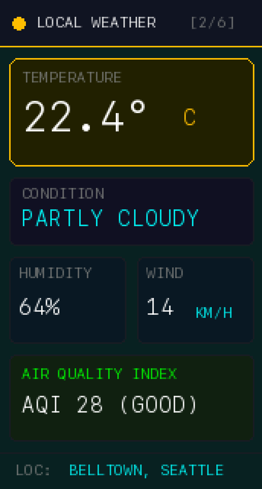
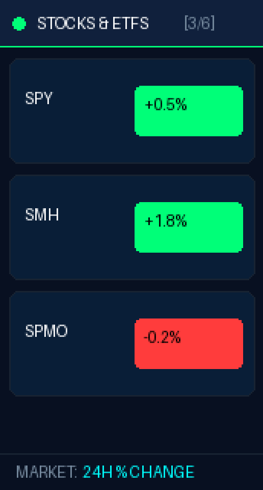
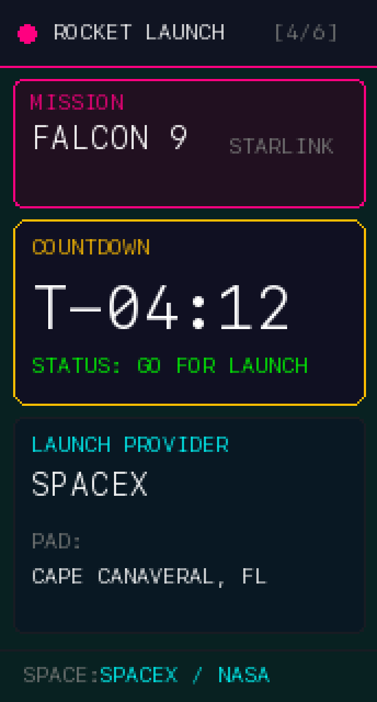
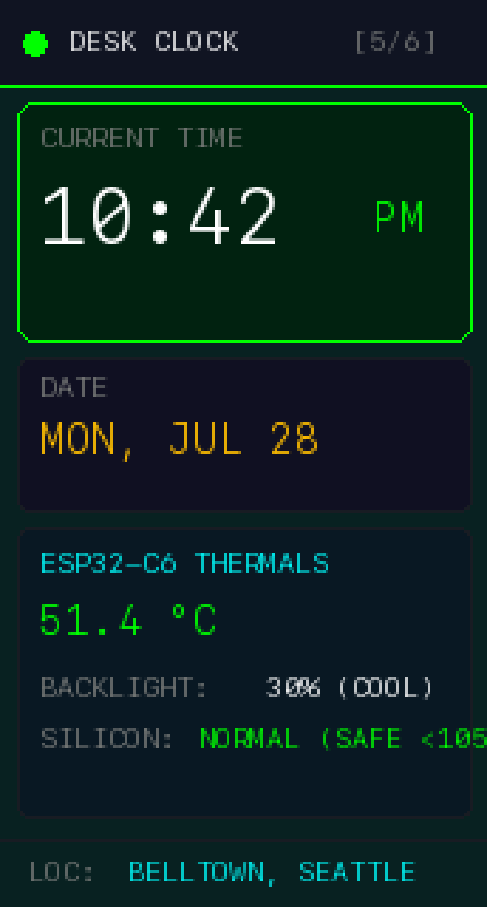
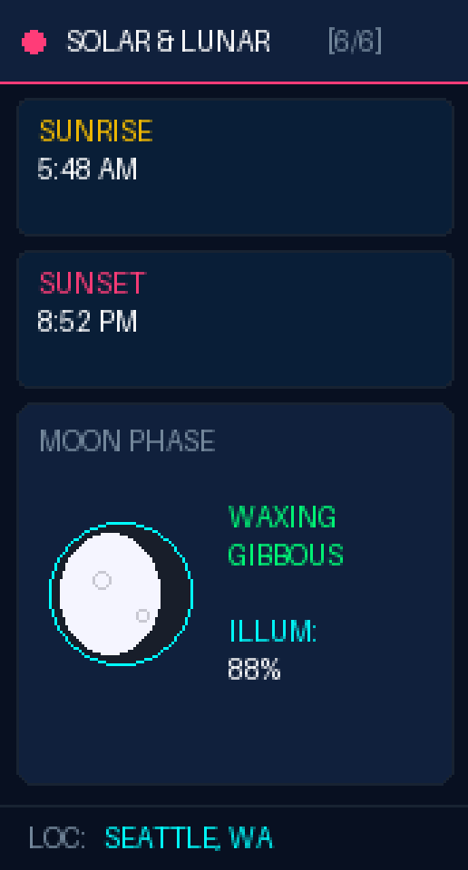

# ESP32-C6 Multi-Dashboard Display (1.47" ST7789 LCD)

An ultra-efficient, low-power, double-buffered multi-dashboard smart display firmware for the **Waveshare ESP32-C6 LCD 1.47" (172x320 IPS)** written in C++ with Arduino GFX and FreeRTOS.

---

## 📸 Dashboard Screens Gallery

All high-definition screenshots are organized in the [`screenshots/`](screenshots/) directory:

| ✈️ 1. Flight Radar Scanner | 🌤️ 2. Weather & Air Quality | 📈 3. Stock & ETF Badges |
| :---: | :---: | :---: |
|  |  |  |

| 🚀 4. Rocket Launch Countdown | ⏰ 5. Desk Clock & Thermals | 🌙 6. 3D Lunar & Solar Tracker |
| :---: | :---: | :---: |
|  |  |  |

---

## ✨ Key Features

- **✈️ Live Flight Radar:** Tracks live overhead aircraft via OpenSky Network API, calculates distance in KM, heading vector, altitude (FT), speed (KTS), airline name, and ICAO route lookups (Origin -> Destination).
- **🌤️ Local Weather & AQI:** Displays live temperature in Celsius (°C), humidity (%), wind speed (KM/H), weather conditions, and Air Quality Index.
- **📈 Stock & ETF Badges:** Clean stock percentage badges for `SPY`, `SMH`, and `SPMO` with color-coded 24h change indicators.
- **🚀 Rocket Launch Countdown:** Tracks upcoming SpaceX / NASA space mission countdowns, launch providers, and pad locations.
- **⏰ Desk Clock & Thermals:** Shows local 12-hour clock, day/date, and live ESP32-C6 chip temperature (°C) and 30% PWM brightness diagnostic status.
- **🌙 3D Moon Phase Sphere:** Renders real-time 3D lunar sphere terminator shading (Waxing/Waning Gibbous & Crescent) with Tycho crater details, illumination percentage, sunrise, and sunset times.
- **⚡ Ultra-Low Power & Fail-Proof:**
  - **Wi-Fi Modem Light Sleep (`WiFi.setSleep(true)`):** Reduces radio power consumption by ~65%.
  - **FreeRTOS Non-Blocking Tasking:** Asynchronous background network fetching ensures 0ms instant button screen skipping.
  - **IRAM_ATTR Hardware Interrupt:** Right BOOT button (GPIO9) triggers instant debounced screen switching.
  - **40MHz High-Speed SPI:** Fast 110KB double-buffer canvas flushing with smart dirty-flag rendering.

---

## 🛠️ Hardware Requirements

- **Microcontroller:** Waveshare ESP32-C6 LCD 1.47" (RISC-V 160MHz, Wi-Fi 6, BLE 5.3)
- **Display:** ST7789 IPS LCD (172x320 resolution)
- **Pin Mapping:**
  - `TFT_BL` -> GPIO 23 (PWM Backlight Duty 75 / 30% Brightness)
  - `TFT_SCLK` -> GPIO 7
  - `TFT_MOSI` -> GPIO 6
  - `TFT_CS` -> GPIO 14
  - `TFT_DC` -> GPIO 15
  - `TFT_RST` -> GPIO 22
  - `BOOT_BTN` -> GPIO 9 (Right Button)

---

## 🚀 Getting Started

1. Clone the repository:
   ```bash
   git clone https://github.com/prasadabhishek/esp32-c6-multi-dashboard.git
   cd esp32-c6-multi-dashboard
   ```
2. Open in VS Code with PlatformIO extension or PlatformIO Core CLI.
3. Update `src/main.cpp` with your Wi-Fi credentials:
   ```cpp
   const char* WIFI_SSID = "YOUR_WIFI_SSID";
   const char* WIFI_PASS = "YOUR_WIFI_PASSWORD";
   ```
4. Build & Upload to ESP32-C6:
   ```bash
   pio run -t upload
   ```

---

## 📄 License

MIT License. Free to use, modify, and build upon.
