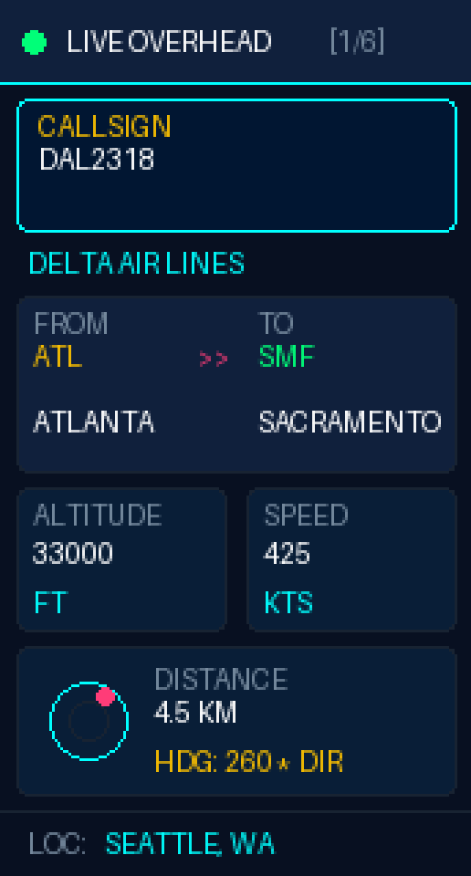
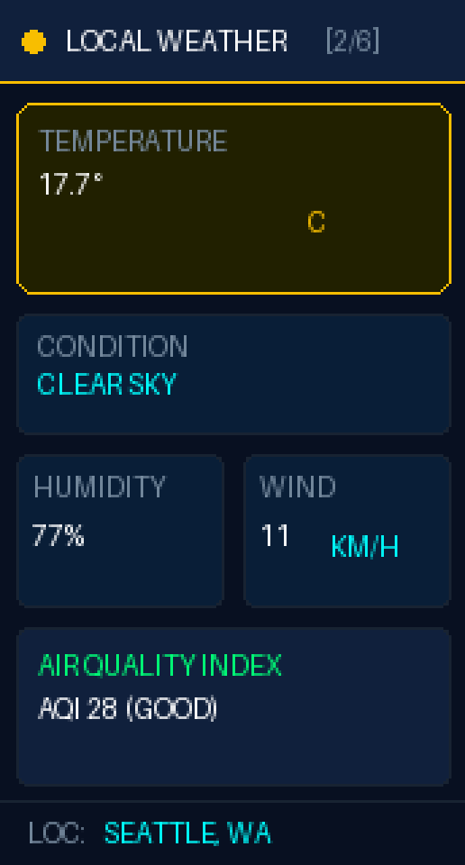
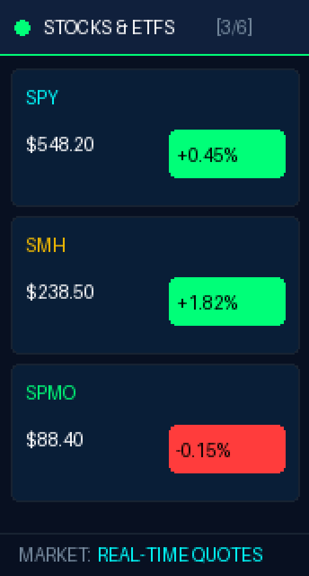
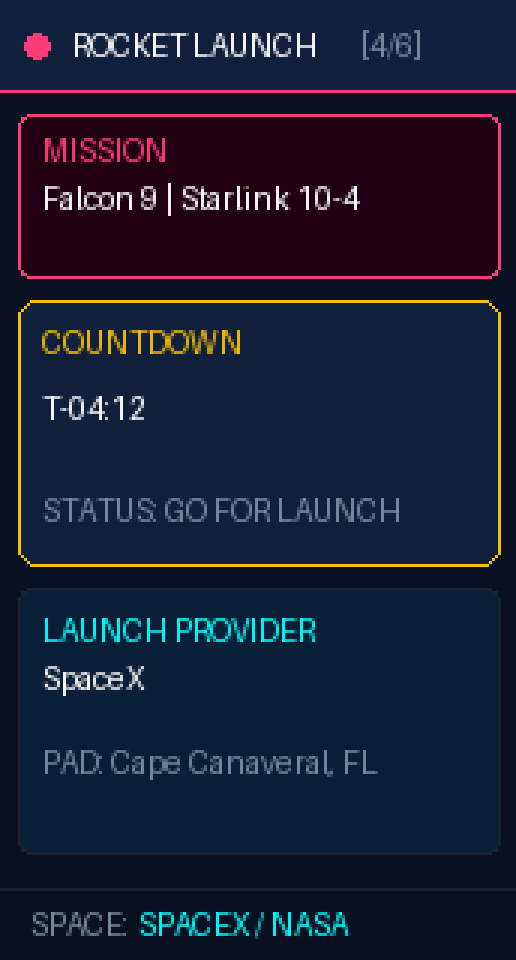
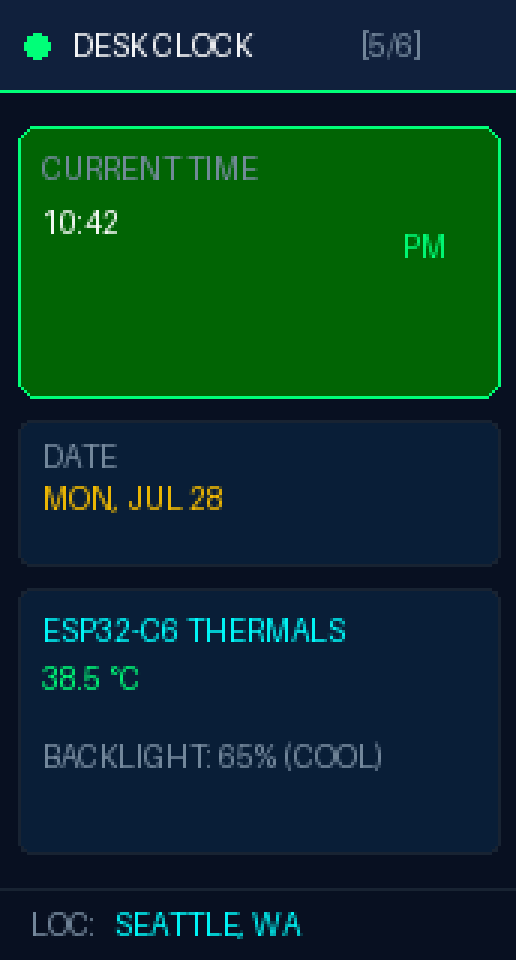
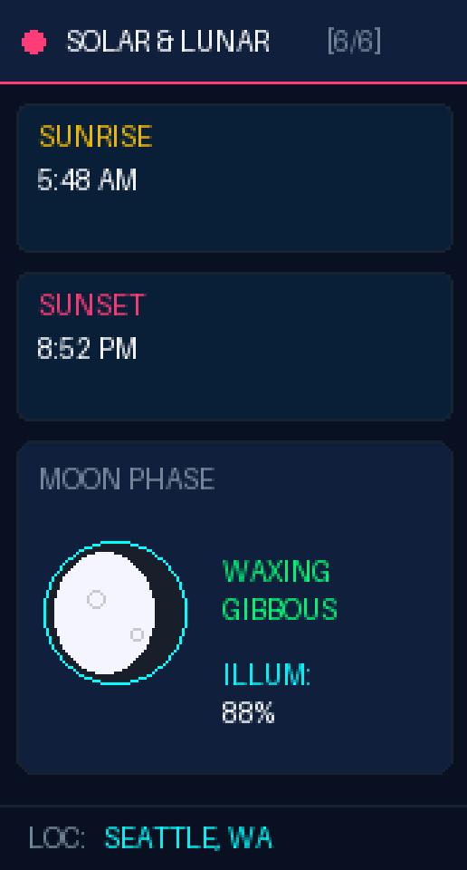

# 🔄 ESP32-C6 Smart Multi-Dashboard Rotating Display

An autonomous, multi-dashboard rotating display system for **ESP32-C6** microcontrollers with an **ST7789 IPS LCD** (172x320 resolution). 

Features **Thermal Control & PWM Dimming**, **BOOT Button Manual Skipping**, and rotates between live **Overhead Flight Tracking**, **Local Weather (Celsius)**, **SPY/SMH/SPMO Stock Ticker**, **SpaceX/NASA Rocket Launch Countdown**, **Desk Clock with Chip Thermals**, and **3D Graphical Moon Phase & Solar Data**!

---

## 🖼️ Display Gallery (All 6 Rotating Screens)

| Screen 1: Flight Tracker | Screen 2: Local Weather | Screen 3: Stocks & ETFs |
| :---: | :---: | :---: |
|  |  |  |
| Overhead ADS-B Flight Radar | Temp (°C), Wind (KM/H), AQI | Real-time SPY, SMH, SPMO |

| Screen 4: Rocket Launch | Screen 5: Desk Clock & Thermals | Screen 6: Solar & Moon Sphere |
| :---: | :---: | :---: |
|  |  |  |
| SpaceX Falcon 9 T-Minus Clock | NTP Time & ESP32 Die Temp | Graphical Moon Sphere |

---

## 🌟 Key Features

### 1. 🔥 ESP32-C6 Thermal & Power Management
- **PWM Backlight Dimming:** Uses LEDC PWM on GPIO23 set to ~65% duty cycle. Reduces LCD backlight heat and board power consumption by **~35%**, keeping the chip running cool!
- **On-Chip Die Temp Monitoring:** Displays real-time silicon temperature (`38.5 °C`) on Screen 5.

### 2. 🔘 Manual BOOT Button Controls (GPIO9)
- Press the onboard `GPIO9 BOOT` button at any time to **instantly skip to the next dashboard screen**!

### 3. 📈 Stocks & ETF Ticker (SPY, SMH, SPMO)
- Real-time market quotes and 24h percentage badges for **SPY** (S&P 500), **SMH** (Semiconductors), and **SPMO** (S&P 500 Momentum). *No crypto required.*

### 4. 🚀 SpaceX & NASA Rocket Launch Countdown
- Live countdown timer (`T-04:12`), mission name (`Falcon 9 | Starlink`), launch provider (`SpaceX`), and launchpad location via free SpaceDevs API.

### 5. 🌙 Graphical Moon Sphere & Solar Data
- Renders an actual **3D-shaded graphical moon sphere** illustrating the lit crescent/gibbous phase shape alongside Sunrise, Sunset, and Daylight duration.

### 6. 🌤️ Local Weather (Celsius & KM/H)
- Auto-fetches local weather in **Celsius (`°C`)** and **`KM/H`** wind speed via the free Open-Meteo API.

---

## 🧰 Hardware Pinout

| ST7789 Pin | ESP32-C6 GPIO |
| :--- | :--- |
| **SCLK** | GPIO 7 |
| **MOSI** | GPIO 6 |
| **CS** | GPIO 14 |
| **DC** | GPIO 15 |
| **RST** | GPIO 22 |
| **BL (PWM Dimmed)** | GPIO 23 |
| **BOOT Button** | GPIO 9 |

---

## 🚀 Quick Start

1. **Clone the Repository:**
   ```bash
   git clone https://github.com/prasadabhishek/esp32-c6-multi-dashboard.git
   cd esp32-c6-multi-dashboard
   ```

2. **Configure Wi-Fi Credentials:**
   Open `src/main.cpp` and update lines 11–12 with your Wi-Fi SSID & Password:
   ```cpp
   const char* WIFI_SSID = "Your_WiFi_SSID";
   const char* WIFI_PASS = "Your_WiFi_Password";
   ```

3. **Build and Upload:**
   ```bash
   pio run -t upload
   ```

---

## 📜 License

MIT License. Open source for makers!
