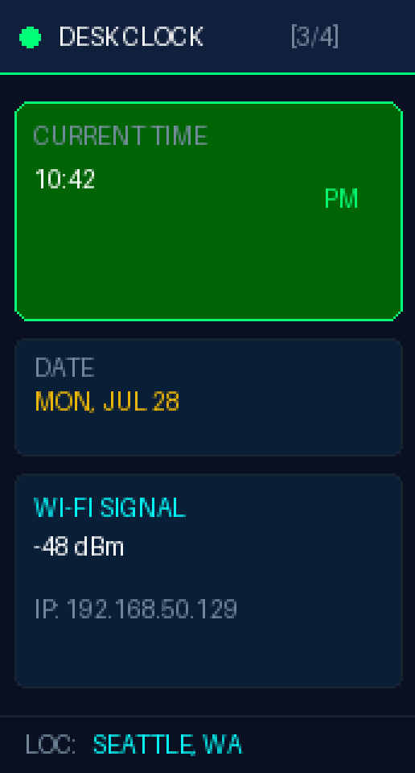
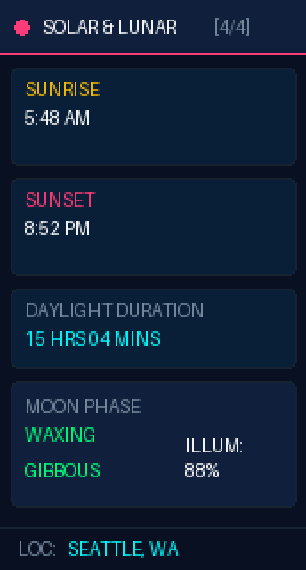

# 🔄 ESP32-C6 Smart Multi-Dashboard Rotating Display

An autonomous, multi-dashboard rotating display system for **ESP32-C6** microcontrollers with an **ST7789 IPS LCD** (172x320 resolution). 

Rotates between live **Overhead Flight Tracking**, **Local Weather (Celsius)**, **Digital Desk Clock**, and **Solar & Lunar Data** (100% free APIs, zero API keys required!).

---

## 🖼️ Display Gallery & Rotating Screens

| Screen 1: Flight Tracker | Screen 2: Local Weather | Screen 3: Desk Clock | Screen 4: Solar & Lunar |
| :---: | :---: | :---: | :---: |
|  |  |  |  |
| Overhead ADS-B Flight Radar | Temperature (°C), Wind, AQI | NTP Time, Date & Wi-Fi | Sunrise, Sunset, Moon Phase |

---

## 🌟 Dashboard Modes & Features

### 1. ✈️ Overhead Flight Tracker
- **ADS-B Radar:** Detects planes flying overhead within a ~20 km radius. Shows Callsign, Airline, Route (`ATL` ➔ `SMF`), Altitude (ft), Speed (kts), Distance (km), Compass Heading, and Mini Radar.
- **OpenSky Network Integration:** Polls free ADS-B transponder data every 12 seconds.

### 2. 🌤️ Local Weather & Air Quality
- **Free Open-Meteo API:** Auto-fetches live weather data based on IP Geolocation:
  - Temperature in Celsius (`°C`) & WMO Weather Condition
  - Humidity % & Wind Speed (`KM/H`)
  - Air Quality Index (AQI Badge)

### 3. ⏰ Digital Desk Clock & Date
- **NTP Time Sync:** Automatic time synchronization via `pool.ntp.org`:
  - Large 12-hour AM/PM Clock
  - Day of Week & Date (e.g. `MON, JUL 28`)
  - Live Wi-Fi Signal Strength (RSSI dBm) & Local IP Address

### 4. 🌅 Solar & Lunar Tracker
- **Seattle / Local Geolocation Data:**
  - Sunrise & Sunset Times (`5:48 AM / 8:52 PM`)
  - Daylight Duration Progress
  - Moon Phase & Illumination % (`Waxing Gibbous 88%`)

---

## 🧰 Hardware & Pinout

| Hardware Component | Specification |
| :--- | :--- |
| **Microcontroller** | ESP32-C6 (RISC-V @ 160MHz, 8MB Flash) e.g., Waveshare ESP32-C6 LCD 1.47" |
| **Display** | 1.47" ST7789 IPS Color LCD (172 x 320 portrait) |

| ST7789 SPI Pin | ESP32-C6 GPIO |
| :--- | :--- |
| **SCLK** | GPIO 7 |
| **MOSI** | GPIO 6 |
| **CS** | GPIO 14 |
| **DC** | GPIO 15 |
| **RST** | GPIO 22 |
| **BL** | GPIO 23 |

---

## 🚀 Quick Start

1. **Clone the Repository:**
   ```bash
   git clone https://github.com/prasadabhishek/esp32-c6-multi-dashboard.git
   cd esp32-c6-multi-dashboard
   ```

2. **Configure Wi-Fi Credentials:**
   Open `src/main.cpp` and update lines 11–12 with your Wi-Fi SSID & Password:
   ```cpp
   const char* WIFI_SSID = "Your_WiFi_SSID";
   const char* WIFI_PASS = "Your_WiFi_Password";
   ```

3. **Build and Upload:**
   ```bash
   pio run -t upload
   ```

---

## 📜 License

MIT License. Open source for makers!
